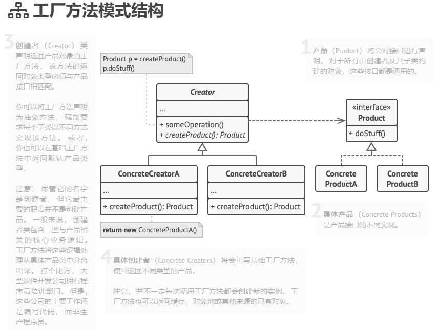

# 工厂模式

**工厂方法模式是一种创建型设计模式， 其在父类中提供一个创建对象的方法， 允许子类决定实例化对象的类型。**

## Tips

1. IOC容器可以被视为一种工厂模式的具体实现。
2. 工厂模式是多态的体现

## 工厂模式类型

- **简单工厂模式**
  - 简单工厂模式不是一个正式的设计模式，但它是工厂模式的基础。它使用一个单独的工厂类来创建不同的对象，根据传入的参数决定创建哪种类型的对象。
- **工厂方法模式**
  - 工厂方法模式定义了一个创建对象的接口，但由子类决定实例化哪个类。工厂方法使一个类的实例化延迟到其子类。
- **抽象工厂模式**
  - 抽象工厂模式提供了一个创建一系列相关或相互依赖对象的接口，而无需指定它们的具体类。

## 工厂模式结构

#### 角色

- **产品 （Product）**  将会对接口进行声明。 对于所有由创建者及其子类构建的对象， 这些接口都是通用的。
- **具体产品 （Concrete Products）** 是产品接口的不同实现。
- **创建者 （Creator） 类**声明返回产品对象的工厂方法。 该方法的返回对象类型必须与产品接口相匹配。
你可以将工厂方法声明为抽象方法， 强制要求每个子类以不同方式实现该方法。 或者， 你也可以在基础工厂方法中返回默认产品类型。
- **具体创建者 （Concrete Creators）** 将会重写基础工厂方法， 使其返回不同类型的产品。
  **注意，** 并不一定每次调用工厂方法都会创建新的实例。 工厂方法也可以返回缓存、 对象池或其他来源的已有对象。

## 应用场景

- **无法预知对象确切类别及其依赖关系时， 可使用工厂方法。**
- **想要别人能扩展你软件库或框架的内部组件， 可使用工厂方法。**

## 优缺点

| 优点                                                                             | 缺点                                                                                                                 |
| -------------------------------------------------------------------------------- | -------------------------------------------------------------------------------------------------------------------- |
| 可以避免创建者和具体产品之间的紧密耦合。                                         | 应用工厂方法模式需要引入许多新的子类， 代码可能会因此变得更复杂。 最好的情况是将该模式引入创建者类的现有层次结构中。 |
| 单一职责原则。 你可以将产品创建代码放在程序的单一位置， 从而使得代码更容易维护。 |                                                                                                                      |
| 开闭原则。 无需更改现有客户端代码， 你就可以在程序中引入新的产品类型。           |                                                                                                                      |

