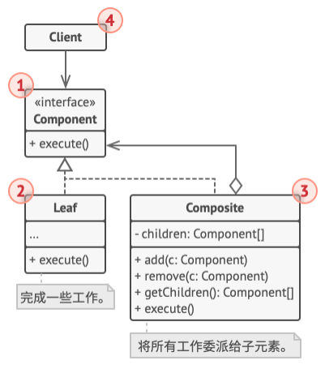

# 组合模式（Composite）

**组合模式**是一种结构型设计模式， 你可以使用它将对象组合成树状结构， 并且能像使用独立对象一样使用它们。

#### 个人理解

> 这里面有两个概念，一个是组合（容器），一个是叶子（非容器）。容器中可以包含其他的容器和叶子，叶子中则不能包含其他东西。这样就可以形成一个树状结构。这两个类型的类都会继承一个接口或者抽象类，我们只需要操作抽象的类或接口，不需要关心具体的类型，这样就可以通过递归的方式遍历整个树状结构，并统一执行某些相同的操作。就类似与c#或java中的object类。

## 组合模式结构



1. **组件** （Component） 接口描述了树中简单项目和复杂项目所共有的操作。
2. **叶节点** （Leaf） 是树的基本结构， 它不包含子项目。

    一般情况下， 叶节点最终会完成大部分的实际工作， 因为它们无法将工作指派给其他部分。
3. **容器** （Container）——又名 “组合 （Composite）”——是包含叶节点或其他容器等子项目的单位。 容器不知道其子项目所属的具体类， 它只通过通用的组件接口与其子项目交互。

    容器接收到请求后会将工作分配给自己的子项目， 处理中间结果， 然后将最终结果返回给客户端。
4. **客户端** （Client） 通过组件接口与所有项目交互。 因此， 客户端能以相同方式与树状结构中的简单或复杂项目交互。
   
## 优缺点

| 优点                                                                                | 缺点                                                                                                               |
| ----------------------------------------------------------------------------------- | ------------------------------------------------------------------------------------------------------------------ |
| 可以利用多态和递归机制更方便地使用复杂树结构。                                      | 对于功能差异较大的类， 提供公共接口或许会有困难。 在特定情况下， 你需要过度一般化组件接口， 使其变得令人难以理解。 |
| 开闭原则。 无需更改现有代码， 你就可以在应用中添加新元素， 使其成为对象树的一部分。 |                                                                                                                    |

#### 伪代码

```csharp
    // 组件接口会声明组合中简单和复杂对象的通用操作。
    interface Graphic is
        method move(x, y)
        method draw()

    // 叶节点类代表组合的终端对象。叶节点对象中不能包含任何子对象。叶节点对象
    // 通常会完成实际的工作，组合对象则仅会将工作委派给自己的子部件。
    class Dot implements Graphic is
        field x, y

        constructor Dot(x, y) { …… }

        method move(x, y) is
            this.x += x, this.y += y

        method draw() is
            // 在坐标位置(X,Y)处绘制一个点。

    // 所有组件类都可以扩展其他组件。
    class Circle extends Dot is
        field radius

        constructor Circle(x, y, radius) { …… }

        method draw() is
            // 在坐标位置(X,Y)处绘制一个半径为 R 的圆。

    // 组合类表示可能包含子项目的复杂组件。组合对象通常会将实际工作委派给子项
    // 目，然后“汇总”结果。
    class CompoundGraphic implements Graphic is
        field children: array of Graphic

        // 组合对象可在其项目列表中添加或移除其他组件（简单的或复杂的皆可）。
        method add(child: Graphic) is
            // 在子项目数组中添加一个子项目。

        method remove(child: Graphic) is
            // 从子项目数组中移除一个子项目。

        method move(x, y) is
            foreach (child in children) do
                child.move(x, y)

        // 组合会以特定的方式执行其主要逻辑。它会递归遍历所有子项目，并收集和
        // 汇总其结果。由于组合的子项目也会将调用传递给自己的子项目，以此类推，
        // 最后组合将会完成整个对象树的遍历工作。
        method draw() is
            // 1. 对于每个子部件：
            //     - 绘制该部件。
            //     - 更新边框坐标。
            // 2. 根据边框坐标绘制一个虚线长方形。


    // 客户端代码会通过基础接口与所有组件进行交互。这样一来，客户端代码便可同
    // 时支持简单叶节点组件和复杂组件。
    class ImageEditor is
        field all: CompoundGraphic

        method load() is
            all = new CompoundGraphic()
            all.add(new Dot(1, 2))
            all.add(new Circle(5, 3, 10))
            // ……

        // 将所需组件组合为复杂的组合组件。
        method groupSelected(components: array of Graphic) is
            group = new CompoundGraphic()
            foreach (component in components) do
                group.add(component)
                all.remove(component)
            all.add(group)
            // 所有组件都将被绘制。
            all.draw()
```
