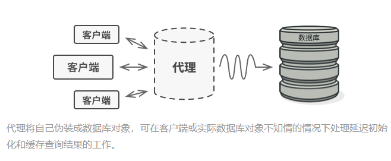
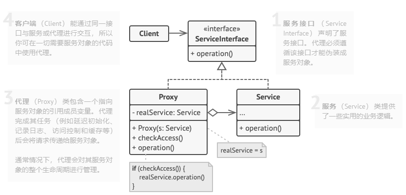

# 代理模式（Proxy）

**代理模式**是一种结构型设计模式， 让你能够提供对象的替代品或其占位符。 代理控制着对于原对象的访问， 并允许在将请求提交给对象前后进行一些处理。



#### 个人理解

> 代理模式就是通过一个代理类来控制对目标类的访问，可以在目标类的方法前后进行一些操作。代理类与目标类具有相同的方法名（相同的调用方法），使得在调用代理类的时候就像在调用目标类一样。与外观模式一样，在客户端和目标类之间增加了一层，使得客户端不直接与目标类进行交互。但代理模式和外观模式之间的区别是，前者的调用方法和目标类的调用方法完全一样；后者则是对目标类（若干个）的调用进行了整合，使得客户端只需要调用一个方法即可。

## 代理模式结构



1. **服务接口 （Service Interface）** 声明了服务接口。 代理必须遵循该接口才能伪装成服务对象。
2. **服务 （Service）** 类提供了一些实用的业务逻辑。
3. **代理 （Proxy）** 类包含一个指向服务对象的引用成员变量。 代理完成其任务 （例如延迟初始化、 记录日志、 访问控制和缓存等） 后会将请求传递给服务对象。
通常情况下， 代理会对其服务对象的整个生命周期进行管理。
4. **客户端 （Client）** 能通过同一接口与服务或代理进行交互， 所以你可在一切需要服务对象的代码中使用代理。

> **注：** 如果没有现成的服务接口， 就需要创建一个接口来实现代理和服务对象的可交换性。 从服务类中抽取接口并非总是可行的， 因为你需要对服务的所有客户端进行修改， 让它们使用接口。 备选计划是将代理作为服务类的子类， 这样代理就能继承服务的所有接口了。

## 优缺点
| 优点                                                                  | 缺点                                    |
| --------------------------------------------------------------------- | --------------------------------------- |
| 你可以在客户端毫无察觉的情况下控制服务对象                            | 代码可能会变得复杂， 因为需要新建许多类 |
| 如果客户端对服务对象的生命周期没有特殊要求， 你可以对生命周期进行管理 | 服务响应可能会延迟。                    |
| 即使服务对象还未准备好或不存在， 代理也可以正常工作                   |                                         |
| 开闭原则。 你可以在不对服务或客户端做出修改的情况下创建新代理         |                                         |


#### 伪代码

```csharp
// 远程服务接口。
interface ThirdPartyTVLib is
    method listVideos()
    method getVideoInfo(id)
    method downloadVideo(id)

// 服务连接器的具体实现。该类的方法可以向腾讯视频请求信息。请求速度取决于
// 用户和腾讯视频的互联网连接情况。如果同时发送大量请求，即使所请求的信息
// 一模一样，程序的速度依然会减慢。
class ThirdPartyTVClass implements ThirdPartyTVLib is
    method listVideos() is
        // 向腾讯视频发送一个 API 请求。

    method getVideoInfo(id) is
        // 获取某个视频的元数据。

    method downloadVideo(id) is
        // 从腾讯视频下载一个视频文件。

// 为了节省网络带宽，我们可以将请求结果缓存下来并保存一段时间。但你可能无
// 法直接将这些代码放入服务类中。比如该类可能是第三方程序库的一部分或其签
// 名是`final（最终）`。因此我们会在一个实现了服务类接口的新代理类中放入
// 缓存代码。当代理类接收到真实请求后，才会将其委派给服务对象。
class CachedTVClass implements ThirdPartyTVLib is
    private field service: ThirdPartyTVLib
    private field listCache, videoCache
    field needReset

    constructor CachedTVClass(service: ThirdPartyTVLib) is
        this.service = service

    method listVideos() is
        if (listCache == null || needReset)
            listCache = service.listVideos()
        return listCache

    method getVideoInfo(id) is
        if (videoCache == null || needReset)
            videoCache = service.getVideoInfo(id)
        return videoCache

    method downloadVideo(id) is
        if (!downloadExists(id) || needReset)
            service.downloadVideo(id)

// 之前直接与服务对象交互的 GUI 类不需要改变，前提是它仅通过接口与服务对
// 象交互。我们可以安全地传递一个代理对象来代替真实服务对象，因为它们都实
// 现了相同的接口。
class TVManager is
    protected field service: ThirdPartyTVLib

    constructor TVManager(service: ThirdPartyTVLib) is
        this.service = service

    method renderVideoPage(id) is
        info = service.getVideoInfo(id)
        // 渲染视频页面。

    method renderListPanel() is
        list = service.listVideos()
        // 渲染视频缩略图列表。

    method reactOnUserInput() is
        renderVideoPage()
        renderListPanel()

// 程序可在运行时对代理进行配置。
class Application is
    method init() is
        aTVService = new ThirdPartyTVClass()
        aTVProxy = new CachedTVClass(aTVService)
        manager = new TVManager(aTVProxy)
        manager.reactOnUserInput()
```