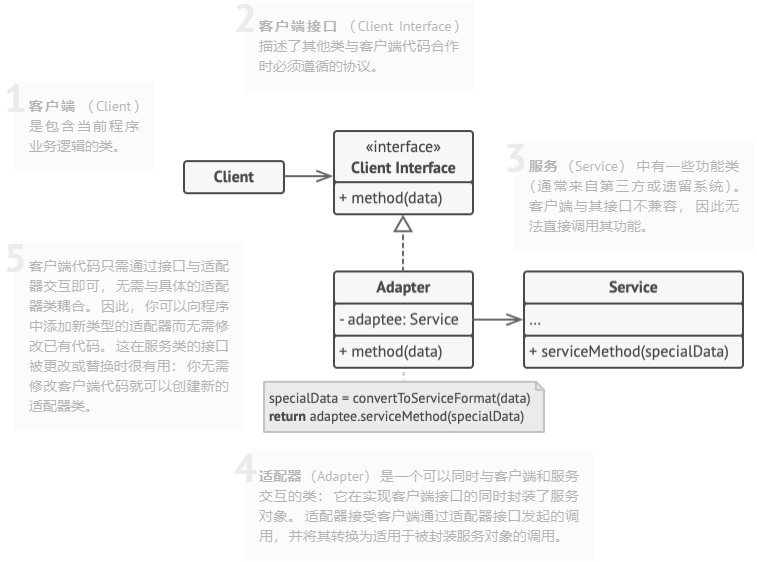
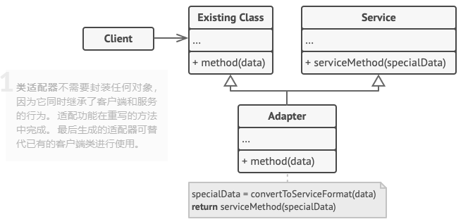

# 适配器模式（Adapter）

**适配器模式**是一种结构型设计模式， 它能使接口不兼容的对象能够相互合作。

## 适配器模式结构

#### 对象适配器（主要）

实现时使用了构成原则： 适配器实现了其中一个对象的接口， 并对另一个对象进行封装。 所有流行的编程语言都可以实现适配器。



1. **客户端** （Client） 是包含当前程序业务逻辑的类。
1. **客户端接口** （Client Interface） 描述了其他类与客户端代码合作时必须遵循的协议。
1. **服务** （Service） 中有一些功能类 （通常来自第三方或遗留系统）。 客户端与其接口不兼容， 因此无法直接调用其功能。
1. **适配器** （Adapter） 是一个可以同时与客户端和服务交互的类： 它在实现客户端接口的同时封装了服务对象。 适配器接受客户端通过适配器接口发起的调用， 并将其转换为适用于被封装服务对象的调用。
1. 客户端代码只需通过接口与适配器交互即可， 无需与具体的适配器类耦合。 因此， 你可以向程序中添加新类型的适配器而无需修改已有代码。 这在服务类的接口被更改或替换时很有用： 你无需修改客户端代码就可以创建新的适配器类。

#### 类适配器

这一实现使用了继承机制： 适配器同时继承两个对象的接口。 请注意， 这种方式仅能在支持多重继承的编程语言中实现， 例如 C++。



1. **类适配器**不需要封装任何对象， 因为它同时继承了客户端和服务的行为。 适配功能在重写的方法中完成。 最后生成的适配器可替代已有的客户端类进行使用。

## 优缺点

| 优点                                                                                                                     | 缺点                                                                                             |
| ------------------------------------------------------------------------------------------------------------------------ | ------------------------------------------------------------------------------------------------ |
| 单一职责原则你可以将接口或数据转换代码从程序主要业务逻辑中分离                                                           | 代码整体复杂度增加， 因为你需要新增一系列接口和类。 有时直接更改服务类使其与其他代码兼容会更简单 |
| 开闭原则。 只要客户端代码通过客户端接口与适配器进行交互， 你就能在不修改现有客户端代码的情况下在程序中添加新类型的适配器 |                                                                                                  |

## 示例代码

```csharp
using System;

namespace RefactoringGuru.DesignPatterns.Adapter.Conceptual
{
    // The Target defines the domain-specific interface used by the client code.
    public interface ITarget
    {
        string GetRequest();
    }

    // The Adaptee contains some useful behavior, but its interface is
    // incompatible with the existing client code. The Adaptee needs some
    // adaptation before the client code can use it.
    class Adaptee
    {
        public string GetSpecificRequest()
        {
            return "Specific request.";
        }
    }

    // The Adapter makes the Adaptee's interface compatible with the Target's
    // interface.
    class Adapter : ITarget
    {
        private readonly Adaptee _adaptee;

        public Adapter(Adaptee adaptee)
        {
            this._adaptee = adaptee;
        }

        public string GetRequest()
        {
            return $"This is '{this._adaptee.GetSpecificRequest()}'";
        }
    }

    class Program
    {
        static void Main(string[] args)
        {
            Adaptee adaptee = new Adaptee();
            ITarget target = new Adapter(adaptee);

            Console.WriteLine("Adaptee interface is incompatible with the client.");
            Console.WriteLine("But with adapter client can call it's method.");

            Console.WriteLine(target.GetRequest());
        }
    }
}
```
