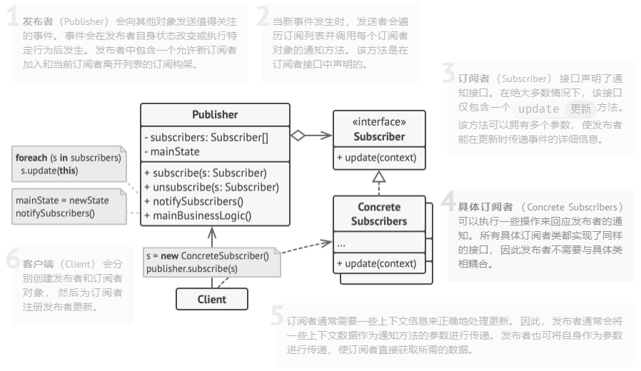

# 观察者模式

**观察者模式**是一种行为设计模式， 允许你定义一种订阅机制， 可在对象事件发生时通知多个 “观察” 该对象的其他对象。

## 观察者模式结构



1. **发布者** （Publisher） 会向其他对象发送值得关注的事件。 事件会在发布者自身状态改变或执行特定行为后发生。 发布者中包含一个允许新订阅者加入和当前订阅者离开列表的订阅构架。
当新事件发生时， 发送者会遍历订阅列表并调用每个订阅者对象的通知方法。 该方法是在订阅者接口中声明的。
1. **订阅者** （Subscriber） 接口声明了通知接口。 在绝大多数情况下， 该接口仅包含一个 `update`更新方法。 该方法可以拥有多个参数， 使发布者能在更新时传递事件的详细信息。
2. **具体订阅者** （Concrete Subscribers） 可以执行一些操作来回应发布者的通知。 所有具体订阅者类都实现了同样的接口， 因此发布者不需要与具体类相耦合。
3. 订阅者通常需要一些上下文信息来正确地处理更新。 因此， 发布者通常会将一些上下文数据作为通知方法的参数进行传递。 发布者也可将自身作为参数进行传递， 使订阅者直接获取所需的数据。
4. **客户端** （Client） 会分别创建发布者和订阅者对象， 然后为订阅者注册发布者更新。

## 优缺点

| 优点                                                                                        | 缺点                     |
| ------------------------------------------------------------------------------------------- | ------------------------ |
| 开闭原则。你无需修改发布者代码就能引入新的订阅者类 （如果是发布者接口则可轻松引入发布者类） | 订阅者的通知顺序是随机的 |
| 你可以在运行时建立对象之间的联系                                                            |                          |

#### 伪代码

```csharp
// 发布者基类包含订阅管理代码和通知方法。
class EventManager is
    private field listeners: hash map of event types and listeners

    method subscribe(eventType, listener) is
        listeners.add(eventType, listener)

    method unsubscribe(eventType, listener) is
        listeners.remove(eventType, listener)

    method notify(eventType, data) is
        foreach (listener in listeners.of(eventType)) do
            listener.update(data)

// 具体发布者包含一些订阅者感兴趣的实际业务逻辑。我们可以从发布者基类中扩
// 展出该类，但在实际情况下并不总能做到，因为具体发布者可能已经是子类了。
// 在这种情况下，你可用组合来修补订阅逻辑，就像我们在这里做的一样。
class Editor is
    public field events: EventManager
    private field file: File

    constructor Editor() is
        events = new EventManager()

    // 业务逻辑的方法可将变化通知给订阅者。
    method openFile(path) is
        this.file = new File(path)
        events.notify("open", file.name)

    method saveFile() is
        file.write()
        events.notify("save", file.name)

    // ……


// 这里是订阅者接口。如果你的编程语言支持函数类型，则可用一组函数来代替整
// 个订阅者的层次结构。
interface EventListener is
    method update(filename)

// 具体订阅者会对其注册的发布者所发出的更新消息做出响应。
class LoggingListener implements EventListener is
    private field log: File
    private field message: string

    constructor LoggingListener(log_filename, message) is
        this.log = new File(log_filename)
        this.message = message

    method update(filename) is
        log.write(replace('%s',filename,message))

class EmailAlertsListener implements EventListener is
    private field email: string
    private field message: string

    constructor EmailAlertsListener(email, message) is
        this.email = email
        this.message = message

    method update(filename) is
        system.email(email, replace('%s',filename,message))


// 应用程序可在运行时配置发布者和订阅者。
class Application is
    method config() is
        editor = new Editor()

        logger = new LoggingListener(
            "/path/to/log.txt",
            "有人打开了文件：%s");
        editor.events.subscribe("open", logger)

        emailAlerts = new EmailAlertsListener(
            "admin@example.com",
            "有人更改了文件：%s")
        editor.events.subscribe("save", emailAlerts)
```
