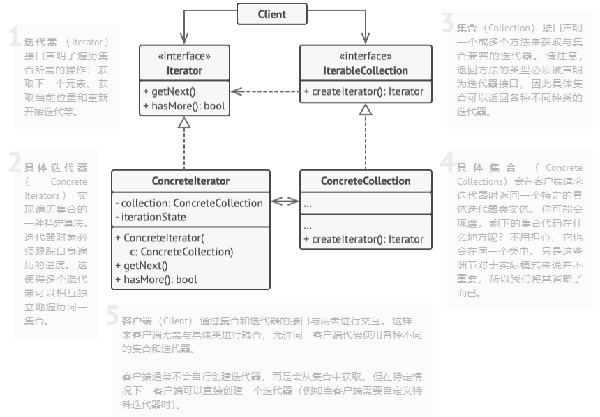

# 迭代器模式（Iterator）

**迭代器模式**是一种行为设计模式， 让你能在不暴露集合底层表现形式 （列表、 栈和树等） 的情况下遍历集合中所有的元素。

#### 个人理解

> 迭代器模式中有两个概念，一个是迭代器，另一个是迭代器集合，具体的迭代器和具体的迭代器集合是耦合在一起的。迭代器实现了`IEnumerator`接口，迭代器集合实现了`IEnumerable`接口，迭代器集合中包含一个迭代器对象，通过迭代器对象遍历集合中的元素。然后在迭代器的`MoveNext()`中可以自定义遍历的方式。
> foreach 底层就使用了迭代器。默认会使用迭代器集合`GetEnumerator()`方法返回的迭代器
> 一个迭代器集合可以有多个迭代器与之匹配，当使用foreach遍历一个有多个迭代器的迭代集合时，需要指定具体的迭代器。
> ``` csharp
>   // 2. 想使用“倒序”迭代器，需手动调用 GetReverseEnumerator，再 foreach
>   foreach (int num in collection.GetReverseEnumerator())
>   {
>      Console.WriteLine("倒序遍历: " + num); 
>      // 输出: 4 3 2 1
>    }
> ```

## 迭代器模式结构



1. **迭代器** （Iterator） 接口声明了遍历集合所需的操作： 获取下一个元素、 获取当前位置和重新开始迭代等。
1. **具体迭代器** （Concrete Iterators） 实现遍历集合的一种特定算法。 迭代器对象必须跟踪自身遍历的进度。 这使得多个迭代器可以相互独立地遍历同一集合。
1. **集合** （Collection） 接口声明一个或多个方法来获取与集合兼容的迭代器。 请注意， 返回方法的类型必须被声明为迭代器接口， 因此具体集合可以返回各种不同种类的迭代器。
1. **具体集合** （Concrete Collections） 会在客户端请求迭代器时返回一个特定的具体迭代器类实体。 你可能会琢磨， 剩下的集合代码在什么地方呢？ 不用担心， 它也会在同一个类中。 只是这些细节对于实际模式来说并不重要， 所以我们将其省略了而已。
2. **客户端** （Client） 通过集合和迭代器的接口与两者进行交互。 这样一来客户端无需与具体类进行耦合， 允许同一客户端代码使用各种不同的集合和迭代器。***每当客户端需要遍历集合元素时都会获取一个新的迭代器。***
客户端通常不会自行创建迭代器， 而是会从集合中获取。 但在特定情况下， 客户端可以直接创建一个迭代器 （例如当客户端需要自定义特殊迭代器时）。

## 优缺点

| 优点                                                                                       | 缺点                                                          |
| ------------------------------------------------------------------------------------------ | ------------------------------------------------------------- |
| 单一职责原则。 通过将体积庞大的遍历算法代码抽取为独立的类， 你可对客户端代码和集合进行整理 | 如果你的程序只与简单的集合进行交互， 应用该模式可能会矫枉过正 |
| 开闭原则。 你可实现新型的集合和迭代器并将其传递给现有代码， 无需修改现有代码               | 对于某些特殊集合， 使用迭代器可能比直接遍历的效率低           |
| 你可以并行遍历同一集合， 因为每个迭代器对象都包含其自身的遍历状态                          |                                                               |
| 相似的， 你可以暂停遍历并在需要时继续                                                      |                                                               |

#### 示例代码

``` csharp
using System;
using System.Collections;
using System.Collections.Generic;

namespace RefactoringGuru.DesignPatterns.Iterator.Conceptual
{
    abstract class Iterator : IEnumerator
    {
        object IEnumerator.Current => Current();

        // Returns the key of the current element
        public abstract int Key();
        
        // Returns the current element
        public abstract object Current();
        
        // Move forward to next element
        public abstract bool MoveNext();
        
        // Rewinds the Iterator to the first element
        public abstract void Reset();
    }

    abstract class IteratorAggregate : IEnumerable
    {
        // Returns an Iterator or another IteratorAggregate for the implementing
        // object.
        public abstract IEnumerator GetEnumerator();
    }

    // Concrete Iterators implement various traversal algorithms. These classes
    // store the current traversal position at all times.
    class AlphabeticalOrderIterator : Iterator
    {
        private WordsCollection _collection;
        
        // Stores the current traversal position. An iterator may have a lot of
        // other fields for storing iteration state, especially when it is
        // supposed to work with a particular kind of collection.
        private int _position = -1;
        
        private bool _reverse = false;

        public AlphabeticalOrderIterator(WordsCollection collection, bool reverse = false)
        {
            this._collection = collection;
            this._reverse = reverse;

            if (reverse)
            {
                this._position = collection.getItems().Count;
            }
        }
        
        public override object Current()
        {
            return this._collection.getItems()[_position];
        }

        public override int Key()
        {
            return this._position;
        }
        
        public override bool MoveNext()
        {
            int updatedPosition = this._position + (this._reverse ? -1 : 1);

            if (updatedPosition >= 0 && updatedPosition < this._collection.getItems().Count)
            {
                this._position = updatedPosition;
                return true;
            }
            else
            {
                return false;
            }
        }
        
        public override void Reset()
        {
            this._position = this._reverse ? this._collection.getItems().Count - 1 : 0;
        }
    }

    // Concrete Collections provide one or several methods for retrieving fresh
    // iterator instances, compatible with the collection class.
    class WordsCollection : IteratorAggregate
    {
        List<string> _collection = new List<string>();
        
        bool _direction = false;
        
        public void ReverseDirection()
        {
            _direction = !_direction;
        }
        
        public List<string> getItems()
        {
            return _collection;
        }
        
        public void AddItem(string item)
        {
            this._collection.Add(item);
        }
        
        public override IEnumerator GetEnumerator()
        {
            return new AlphabeticalOrderIterator(this, _direction);
        }
    }

    class Program
    {
        static void Main(string[] args)
        {
            // The client code may or may not know about the Concrete Iterator
            // or Collection classes, depending on the level of indirection you
            // want to keep in your program.
            var collection = new WordsCollection();
            collection.AddItem("First");
            collection.AddItem("Second");
            collection.AddItem("Third");

            Console.WriteLine("Straight traversal:");

            foreach (var element in collection)
            {
                Console.WriteLine(element);
            }

            Console.WriteLine("\nReverse traversal:");

            collection.ReverseDirection();

            foreach (var element in collection)
            {
                Console.WriteLine(element);
            }
        }
    }
}
```
