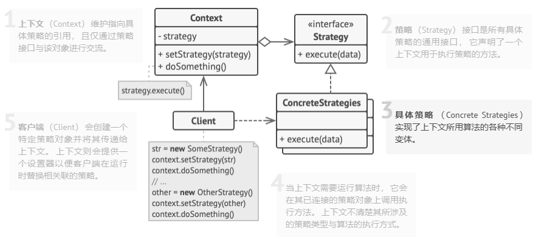

# 策略模式（Strategy）

**策略模式**是一种行为设计模式， 它能让你定义一系列算法， 并将每种算法分别放入独立的类中， 以使算法的对象能够相互替换。

#### 个人理解

> 感觉挺简单的，就是讲一些个方法签名相同，但内部实现不同抽象出来作为一个接口，然后调用者通过存储抽象的接口引用来调用相应的方法，这样调用者就可以不需要在乎具体的实现，达到解耦的效果。

## 策略模式结构



1. **上下文** （Context） 维护指向具体策略的引用， 且仅通过策略接口与该对象进行交流。当上下文需要运行算法时， 它会在其已连接的策略对象上调用执行方法。 上下文不清楚其所涉及的策略类型与算法的执行方式。
1. **策略** （Strategy） 接口是所有具体策略的通用接口， 它声明了一个上下文用于执行策略的方法。
2. **具体策略** （Concrete Strategies） 实现了上下文所用算法的各种不同变体。
3. **客户端** （Client） 会创建一个特定策略对象并将其传递给上下文。 上下文则会提供一个设置器以便客户端在运行时替换相关联的策略。

## 优缺点

| 优点                                                | 缺点                                                                                                                                                                       |
| --------------------------------------------------- | -------------------------------------------------------------------------------------------------------------------------------------------------------------------------- |
| 可以在运行时切换对象内的算法                        | 如果算法极少发生改变， 那么没有任何理由引入新的类和接口。 使用该模式只会让程序过于复杂                                                                                     |
| 可以将算法的实现和使用算法的代码隔离开来            | 客户端必须知晓策略间的不同——它需要选择合适的策略。                                                                                                                         |
| 可以使用组合来代替继承                              | 许多现代编程语言支持函数类型功能， 允许你在一组匿名函数中实现不同版本的算法。 这样， 你使用这些函数的方式就和使用策略对象时完全相同， 无需借助额外的类和接口来保持代码简洁 |
| 开闭原则。 你无需对上下文进行修改就能够引入新的策略 |                                                                                                                                                                            |

#### 示例代码

```csharp
// 策略接口声明了某个算法各个不同版本间所共有的操作。上下文会使用该接口来
// 调用有具体策略定义的算法。
interface Strategy is
    method execute(a, b)

// 具体策略会在遵循策略基础接口的情况下实现算法。该接口实现了它们在上下文
// 中的互换性。
class ConcreteStrategyAdd implements Strategy is
    method execute(a, b) is
        return a + b

class ConcreteStrategySubtract implements Strategy is
    method execute(a, b) is
        return a - b

class ConcreteStrategyMultiply implements Strategy is
    method execute(a, b) is
        return a * b

// 上下文定义了客户端关注的接口。
class Context is
    // 上下文会维护指向某个策略对象的引用。上下文不知晓策略的具体类。上下
    // 文必须通过策略接口来与所有策略进行交互。
    private strategy: Strategy

    // 上下文通常会通过构造函数来接收策略对象，同时还提供设置器以便在运行
    // 时切换策略。
    method setStrategy(Strategy strategy) is
        this.strategy = strategy

    // 上下文会将一些工作委派给策略对象，而不是自行实现不同版本的算法。
    method executeStrategy(int a, int b) is
        return strategy.execute(a, b)


// 客户端代码会选择具体策略并将其传递给上下文。客户端必须知晓策略之间的差
// 异，才能做出正确的选择。
class ExampleApplication is
    method main() is

        创建上下文对象。

        读取第一个数。
        读取最后一个数。
        从用户输入中读取期望进行的行为。

        if (action == addition) then
            context.setStrategy(new ConcreteStrategyAdd())

        if (action == subtraction) then
            context.setStrategy(new ConcreteStrategySubtract())

        if (action == multiplication) then
            context.setStrategy(new ConcreteStrategyMultiply())

        result = context.executeStrategy(First number, Second number)

        打印结果。
```
