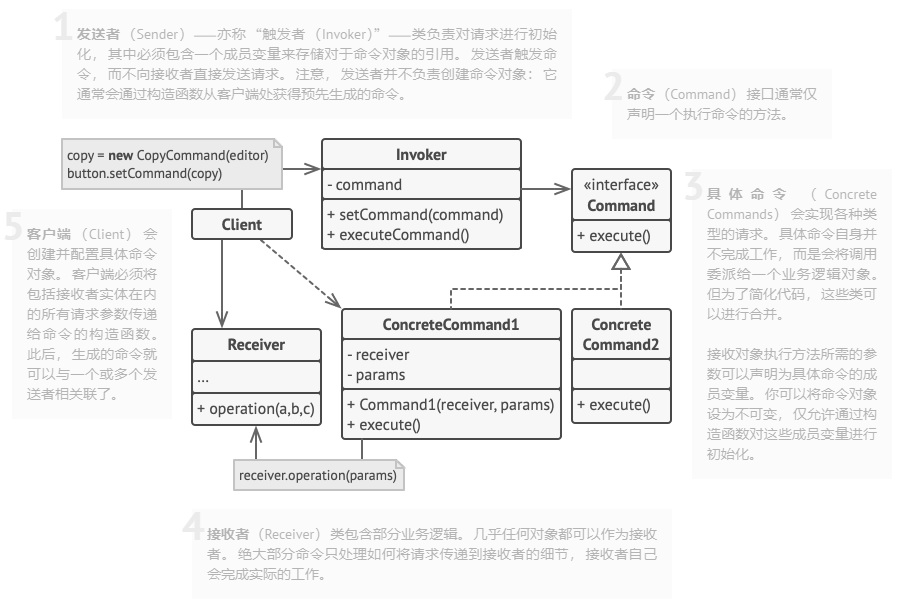

# 命令模式（Command）

**命令模式**是一种行为设计模式， 它可将请求转换为一个包含与请求相关的所有信息的独立对象。 该转换让你能根据不同的请求将方法参数化、 延迟请求执行或将其放入队列中， 且能实现可撤销操作。

#### 个人理解

> 比如说在winform窗体中，当点击了一个按钮之后，我们不会直接执行事件的业务代码，而使创建一个实现了`ICommand`接口的子类，同时会将该业务中会涉及到的对象（接收者）作为构造函数的参数传到命令类中。在命令类里面会实现具体的事件业务流程。而触发者（invoker）这个角色由什么充当，暂时有点迷，有的说可以用一个单例的`CommandManager`来充当。之后再看吧。
> - 似乎要实现“撤销”之类的功能的话，就需要用这个。

## 命令模式结构



1. **发送者** （Sender）——亦称 “触发者 （Invoker）”——类负责对请求进行初始化， 其中必须包含一个成员变量来存储对于命令对象的引用。 发送者触发命令， 而不向接收者直接发送请求。 注意， 发送者并不负责创建命令对象： 它通常会通过构造函数从客户端处获得预先生成的命令。
1. **命令** （Command） 接口通常仅声明一个执行命令的方法。
1. **具体命令** （Concrete Commands） 会实现各种类型的请求。 具体命令自身并不完成工作， 而是会将调用委派给一个业务逻辑对象。 但为了简化代码， 这些类可以进行合并。
接收对象执行方法所需的参数可以声明为具体命令的成员变量。 你可以将命令对象设为不可变， 仅允许通过构造函数对这些成员变量进行初始化。
1. **接收者** （Receiver） 类包含部分业务逻辑。 几乎任何对象都可以作为接收者。 绝大部分命令只处理如何将请求传递到接收者的细节， 接收者自己会完成实际的工作。
1. **客户端** （Client） 会创建并配置具体命令对象。 客户端必须将包括接收者实体在内的所有请求参数传递给命令的构造函数。 此后， 生成的命令就可以与一个或多个发送者相关联了。

## 优缺点

| 优点                                                             | 缺点                                                                  |
| ---------------------------------------------------------------- | --------------------------------------------------------------------- |
| 单一职责原则。可以解耦触发和执行操作的类                         | 代码可能会变得更加复杂， 因为在发送者和接收者之间增加了一个全新的层次 |
| 开闭原则。可以在不修改已有客户端代码的情况下在程序中创建新的命令 |                                                                       |
| 可以实现撤销和恢复功能                                           |                                                                       |
| 可以实现操作的延迟执行                                           |                                                                       |
| 可以将一组简单命令组合成一个复杂命令                             |                                                                       |

#### 示例代码

```csharp
using System;

namespace RefactoringGuru.DesignPatterns.Command.Conceptual
{
    // The Command interface declares a method for executing a command.
    public interface ICommand
    {
        void Execute();
    }

    // Some commands can implement simple operations on their own.
    class SimpleCommand : ICommand
    {
        private string _payload = string.Empty;

        public SimpleCommand(string payload)
        {
            this._payload = payload;
        }

        public void Execute()
        {
            Console.WriteLine($"SimpleCommand: See, I can do simple things like printing ({this._payload})");
        }
    }

    // However, some commands can delegate more complex operations to other
    // objects, called "receivers."
    class ComplexCommand : ICommand
    {
        private Receiver _receiver;

        // Context data, required for launching the receiver's methods.
        private string _a;

        private string _b;

        // Complex commands can accept one or several receiver objects along
        // with any context data via the constructor.
        public ComplexCommand(Receiver receiver, string a, string b)
        {
            this._receiver = receiver;
            this._a = a;
            this._b = b;
        }

        // Commands can delegate to any methods of a receiver.
        public void Execute()
        {
            Console.WriteLine("ComplexCommand: Complex stuff should be done by a receiver object.");
            this._receiver.DoSomething(this._a);
            this._receiver.DoSomethingElse(this._b);
        }
    }

    // The Receiver classes contain some important business logic. They know how
    // to perform all kinds of operations, associated with carrying out a
    // request. In fact, any class may serve as a Receiver.
    class Receiver
    {
        public void DoSomething(string a)
        {
            Console.WriteLine($"Receiver: Working on ({a}.)");
        }

        public void DoSomethingElse(string b)
        {
            Console.WriteLine($"Receiver: Also working on ({b}.)");
        }
    }

    // The Invoker is associated with one or several commands. It sends a
    // request to the command.
    class Invoker
    {
        private ICommand _onStart;

        private ICommand _onFinish;

        // Initialize commands.
        public void SetOnStart(ICommand command)
        {
            this._onStart = command;
        }

        public void SetOnFinish(ICommand command)
        {
            this._onFinish = command;
        }

        // The Invoker does not depend on concrete command or receiver classes.
        // The Invoker passes a request to a receiver indirectly, by executing a
        // command.
        public void DoSomethingImportant()
        {
            Console.WriteLine("Invoker: Does anybody want something done before I begin?");
            if (this._onStart is ICommand)
            {
                this._onStart.Execute();
            }
            
            Console.WriteLine("Invoker: ...doing something really important...");
            
            Console.WriteLine("Invoker: Does anybody want something done after I finish?");
            if (this._onFinish is ICommand)
            {
                this._onFinish.Execute();
            }
        }
    }

    class Program
    {
        static void Main(string[] args)
        {
            // The client code can parameterize an invoker with any commands.
            Invoker invoker = new Invoker();
            invoker.SetOnStart(new SimpleCommand("Say Hi!"));
            Receiver receiver = new Receiver();
            invoker.SetOnFinish(new ComplexCommand(receiver, "Send email", "Save report"));

            invoker.DoSomethingImportant();
        }
    }
}
```
