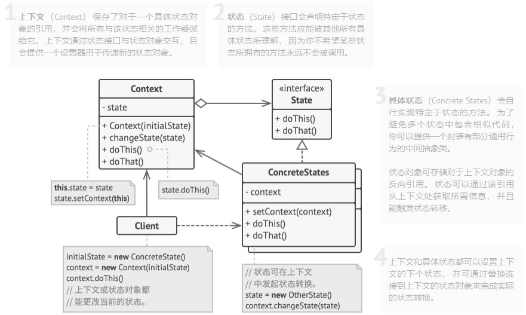

# 状态模式（State）

**状态模式**是一种行为设计模式， 让你能在一个对象的内部状态变化时改变其行为， 使其看上去就像改变了自身所属的类一样。

###### 有限状态机

状态模式与有限状态机的概念紧密相关。其主要思想是程序在任意时刻仅可处于几种有限的状态中。 在任何一个特定状态中， 程序的行为都不相同， 且可瞬间从一个状态切换到另一个状态。 不过， 根据当前状态， 程序可能会切换到另外一种状态， 也可能会保持当前状态不变。 这些数量有限且预先定义的状态切换规则被称为转移。

## 状态模式实现思路

1. 状态模式建议为对象的所有可能状态新建一个类， 然后将所有状态的对应行为抽取到这些类中。

2. 原始对象被称为上下文 （context）， 它并不会自行实现所有行为， 而是会保存一个指向表示当前状态的状态对象的引用， 且将所有与状态相关的工作委派给该对象。

3. 如需将上下文转换为另外一种状态， 则需将当前活动的状态对象替换为另外一个代表新状态的对象。 采用这种方式是有前提的： 所有状态类都必须遵循同样的接口， 而且上下文必须仅通过接口与这些对象进行交互。

4. 这个结构可能看上去与策略模式相似， 但有一个关键性的不同——在状态模式中， **特定状态知道其他所有状态的存在**， 且能触发从一个状态到另一个状态的转换；**策略则几乎完全不知道其他策略的存在。**

## 状态模式结构

1. **上下文** （Context） 保存了对于一个具体状态对象的引用， 并会将所有与该状态相关的工作委派给它。 上下文通过状态接口与状态对象交互， 且会提供一个设置器用于传递新的状态对象。
1. **状态** （State） 接口会声明特定于状态的方法。 这些方法应能被其他所有具体状态所理解， 因为你不希望某些状态所拥有的方法永远不会被调用。
1. **具体状态** （Concrete States） 会自行实现特定于状态的方法。 为了避免多个状态中包含相似代码， 你可以提供一个封装有部分通用行为的中间抽象类。
状态对象可存储对于上下文对象的反向引用。 状态可以通过该引用从上下文处获取所需信息， 并且能触发状态转移。
1. 上下文和具体状态都可以设置上下文的下个状态， 并可通过替换连接到上下文的状态对象来完成实际的状态转换。

## 优缺点

| 优点                                                | 缺点                                                                               |
| --------------------------------------------------- | ---------------------------------------------------------------------------------- |
| 单一职责原则。 将与特定状态相关的代码放在单独的类中 | 如果状态机只有很少的几个状态， 或者很少发生改变， 那么应用该模式可能会显得小题大作 |
| 开闭原则。 无需修改已有状态类和上下文就能引入新状态 |                                                                                    |
| 通过消除臃肿的状态机条件语句简化上下文代码          |                                                                                    |
