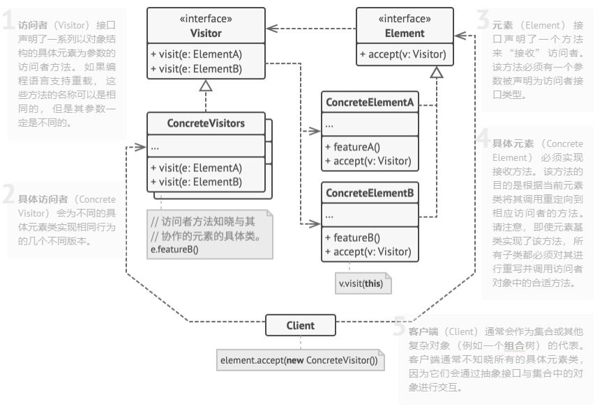
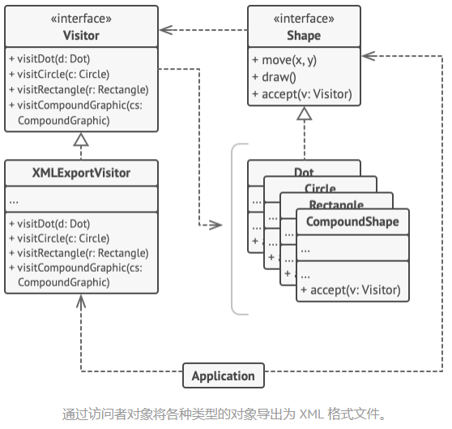

# 访问者模式（Visitor）

**访问者模式**是一种行为设计模式， 它能将算法与其所作用的对象隔离开来。

访问者模式建议将新行为放入一个名为访问者的独立类中， 而不是试图将其整合到已有类中。 现在， 需要执行操作的原始对象将作为参数被传递给访问者中的方法， 让方法能访问对象所包含的一切必要数据。

> ***虽然不准确，但差不多是这个理：**“只是调用者不是我，而是客户端：客户端调用你的方法，会把我传进去，你在方法中再调用我的方法，并把你自己作为参数传进来”*

## 访问者模式结构



1. **访问者** （Visitor） 接口声明了一系列以对象结构的具体元素为参数的访问者方法。 如果编程语言支持重载， 这些方法的名称可以是相同的， 但是其参数一定是不同的。
1. **具体访问者** （Concrete Visitor） 会为不同的具体元素类实现相同行为的几个不同版本。
1. **元素** （Element） 接口声明了一个方法来 “接收” 访问者。 该方法必须有一个参数被声明为访问者接口类型。
1. **具体元素** （Concrete Element） 必须实现接收方法。 该方法的目的是根据当前元素类将其调用重定向到相应访问者的方法。 请注意， 即使元素基类实现了该方法， 所有子类都必须对其进行重写并调用访问者对象中的合适方法。
1. **客户端** （Client） 通常会作为集合或其他复杂对象的代表。 客户端通常不知晓所有的具体元素类， 因为它们会通过抽象接口与集合中的对象进行交互。

## 优缺点

| 优点                                                                                                                                                             | 缺点                                                                            |
| ---------------------------------------------------------------------------------------------------------------------------------------------------------------- | ------------------------------------------------------------------------------- |
| 开闭原则。 你可以引入在不同类对象上执行的新行为， 且无需对这些类做出修改                                                                                         | 每次在元素层次结构中添加或移除一个类时， 你都要更新所有的访问者                 |
| 单一职责原则。 可将同一行为的不同版本移到同一个类中                                                                                                              | 在访问者同某个元素进行交互时， 它们可能没有访问元素私有成员变量和方法的必要权限 |
| 访问者对象可以在与各种对象交互时收集一些有用的信息。 当你想要遍历一些复杂的对象结构 （例如对象树）， 并在结构中的每个对象上应用访问者时， 这些信息可能会有所帮助 |                                                                                 |

#### 示例代码



```csharp
// 元素接口声明了一个`accept（接收）`方法，它会将访问者基础接口作为一个参
// 数。
interface Shape is
    method move(x, y)
    method draw()
    method accept(v: Visitor)

// 每个具体元素类都必须以特定方式实现`accept`方法，使其能调用相应元素类的
// 访问者方法。
class Dot implements Shape is
    // ……

    // 注意我们正在调用的`visitDot（访问点）`方法与当前类的名称相匹配。
    // 这样我们能让访问者知晓与其交互的元素类。
    method accept(v: Visitor) is
        v.visitDot(this)

class Circle implements Shape is
    // ……
    method accept(v: Visitor) is
        v.visitCircle(this)

class Rectangle implements Shape is
    // ……
    method accept(v: Visitor) is
        v.visitRectangle(this)

class CompoundShape implements Shape is
    // ……
    method accept(v: Visitor) is
        v.visitCompoundShape(this)


// 访问者接口声明了一组与元素类对应的访问方法。访问方法的签名能让访问者准
// 确辨别出与其交互的元素所属的类。
interface Visitor is
    method visitDot(d: Dot)
    method visitCircle(c: Circle)
    method visitRectangle(r: Rectangle)
    method visitCompoundShape(cs: CompoundShape)

// 具体访问者实现了同一算法的多个版本，而且该算法能与所有具体类进行交互。
//
// 访问者模式在复杂对象结构（例如组合树）上使用时能发挥最大作用。在这种情
// 况下，它可以存储算法的一些中间状态，并同时在结构中的不同对象上执行访问
// 者方法。这可能会非常有帮助。
class XMLExportVisitor implements Visitor is
    method visitDot(d: Dot) is
        // 导出点（dot）的 ID 和中心坐标。

    method visitCircle(c: Circle) is
        // 导出圆（circle）的 ID 、中心坐标和半径。

    method visitRectangle(r: Rectangle) is
        // 导出长方形（rectangle）的 ID 、左上角坐标、宽和长。

    method visitCompoundShape(cs: CompoundShape) is
        // 导出图形（shape）的 ID 和其子项目的 ID 列表。


// 客户端代码可在不知晓具体类的情况下在一组元素上运行访问者操作。“接收”操
// 作会将调用定位到访问者对象的相应操作上。
class Application is
    field allShapes: array of Shapes

    method export() is
        exportVisitor = new XMLExportVisitor()

        foreach (shape in allShapes) do
            shape.accept(exportVisitor)
```
