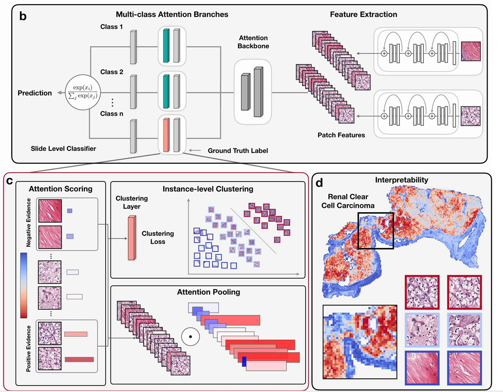
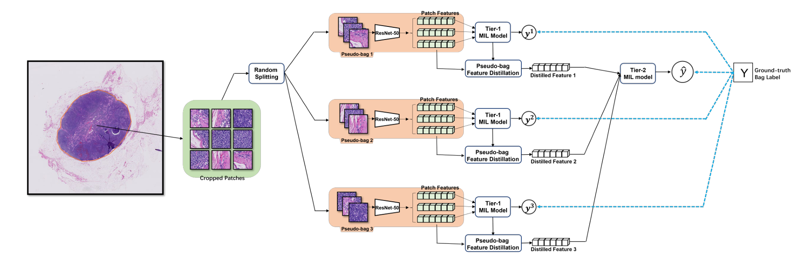
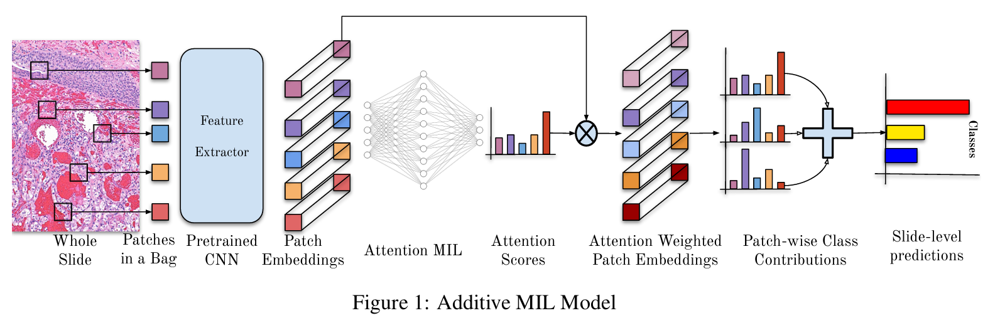

## ABMIL

(ICML 2018)[Attention-based Deep Multiple Instance Learning](https://arxiv.org/abs/1802.04712)

## TransMIL

(NeurIPS 2021)[TransMIL: Transformer based Correlated Multiple Instance Learning for Whole Slide Image Classification](https://arxiv.org/abs/2106.00908)

## DS-MIL

(CVPR 2021)[Dual-stream Multiple Instance Learning Network for Whole Slide Image Classification with Self-supervised Contrastive Learning](https://arxiv.org/abs/2011.08939)

## CLAM

(NAT BIOMED ENG 2021)[Data Efficient and Weakly Supervised Computational Pathology on Whole Slide Images](https://arxiv.org/abs/2004.09666)

## DTFD

(CVPR 2022)[DTFD-MIL: Double-Tier Feature Distillation Multiple Instance Learning for Histopathology Whole Slide Image Classification](https://arxiv.org/abs/2203.12081)

## ADD-MIL

(NeurIPS 2022)[Additive MIL: Intrinsically Interpretable Multiple Instance Learning for Pathology](https://arxiv.org/abs/2206.01794)

