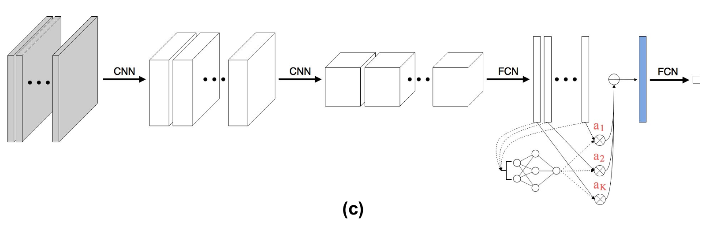
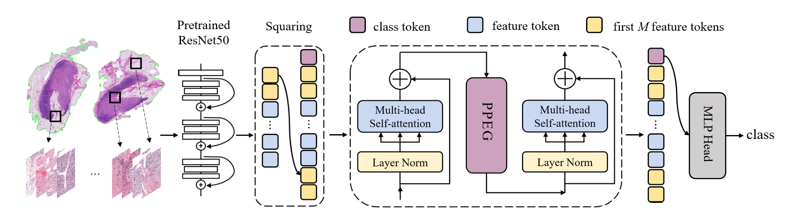
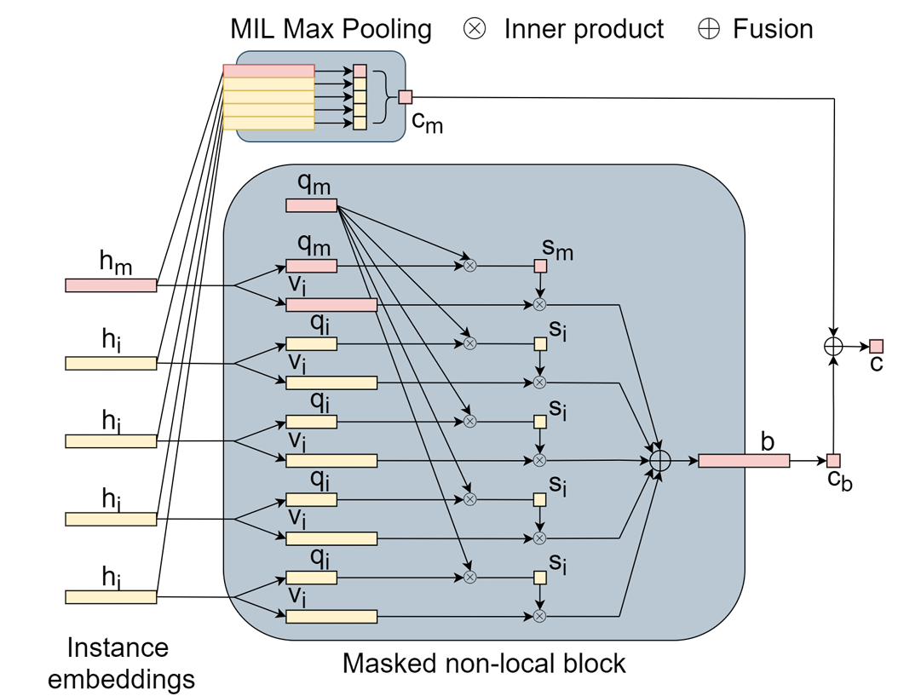

## ABMIL

(ICML 2018)[Attention-based Deep Multiple Instance Learning](https://arxiv.org/abs/1802.04712)

## TransMIL

(NeurIPS 2021)[ TransMIL: Transformer based Correlated Multiple Instance Learning for Whole Slide Image Classification](https://arxiv.org/abs/2106.00908)

## DS-MIL

(CVPR 2021)[Dual-stream Multiple Instance Learning Network for Whole Slide Image Classification with Self-supervised Contrastive Learning](https://arxiv.org/abs/2011.08939)

