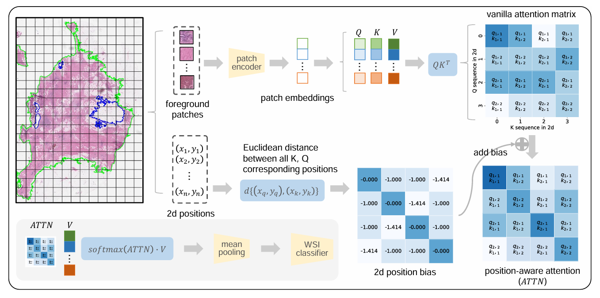

## ABMIL	(ICML 2018)

[Attention-based Deep Multiple Instance Learning](https://arxiv.org/abs/1802.04712)

## TransMIL	(NeurIPS 2021)

[TransMIL: Transformer based Correlated Multiple Instance Learning for Whole Slide Image Classification](https://arxiv.org/abs/2106.00908)

## DS-MIL	(CVPR 2021)

[Dual-stream Multiple Instance Learning Network for Whole Slide Image Classification with Self-supervised Contrastive Learning](https://arxiv.org/abs/2011.08939)

## CLAM	(NAT BIOMED ENG 2021)

[Data Efficient and Weakly Supervised Computational Pathology on Whole Slide Images](https://arxiv.org/abs/2004.09666)

## DTFD	(CVPR 2022)

[DTFD-MIL: Double-Tier Feature Distillation Multiple Instance Learning for Histopathology Whole Slide Image Classification](https://arxiv.org/abs/2203.12081)

## ADD-MIL	(NeurIPS 2022)

[Additive MIL: Intrinsically Interpretable Multiple Instance Learning for Pathology](https://arxiv.org/abs/2206.01794)

## ILRA-MIL	 (ICLR 2023)

[Exploring Low-rank Property in MIL for Whole Slide Image classification](https://openreview.net/pdf?id=01KmhBsEPFO)

## WIKG	(CVPR 2024)

[Dynamic Graph Representation with Knowledge-aware Attention for WSI Analysis](https://arxiv.org/abs/2403.07719) 

## RRT	(CVPR 2024)

[Feature Re-Embedding: Towards Foundation Model-Level Performance in Computational Pathology](https://arxiv.org/abs/2402.17228)

## ViLa-MIL	(CVPR 2024)

[ViLa-MIL: Dual-scale Vision-Language Multiple Instance Learning for Whole Slide Image Classification](https://arxiv.org/abs/2502.08391)

## AMD-MIL	(MM 2024)

[Agent Aggregator with Mask Denoise Mechanism for Histopathology WSI Analysis](https://dl.acm.org/doi/10.1145/3664647.3681425) 

## FR-MIL	(TMI 2024)

[Distribution Re-calibration based MIL with Transformer for WSI Classification](https://ieeexplore.ieee.org/abstract/document/10640165) 

## Long-MIL	(NeurIPS 2024)

[Scaling Long Contextual MIL for Histopathology WSI Analysis](https://arxiv.org/abs/2311.12885) 

## DGR-MIL	(ECCV 2024)

[Exploring Diverse Global Representation in MIL for WSI Classification](https://arxiv.org/abs/2407.03575) 

## CDP-MIL	(ECCV 2024)

[cDP-MIL: Robust Multiple Instance Learning via Cascaded Dirichlet Process](https://arxiv.org/abs/2407.11448) 

## DGR-MIL	(ECCV 2024)

[ DGR-MIL: Exploring Diverse Global Representation in Multiple Instance Learning for Whole Slide Image Classification](https://arxiv.org/abs/2407.03575)

## CA-MIL	(ICLR 2024)

[Context-Aware Multiple Instance Learning for WSI Classification](https://arxiv.org/pdf/2305.05314) 

## AC-MIL	(ECCV 2024)

[Attention-Challenging Multiple Instance Learning for WSI Classification](https://arxiv.org/pdf/2311.07125) 

## CS-MIL	(MIA 2024)

[Cross-scale Multi-instance Learning for Pathological Image Diagnosis](https://arxiv.org/abs/2304.00216)

