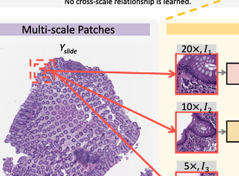
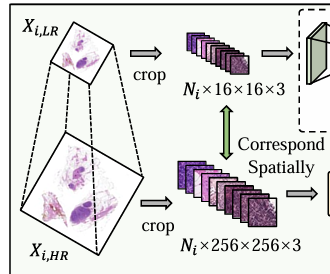

## 分块

方案两种有依据感受野划分

多尺寸



多倍率



```bash
python create_patches_fp.py --source "./patch" --save_dir "./save3" --patch_size 512 --step_size 512 --patch_level 0 --preset bwh_biopsy.csv --seg --patch --stitch

python create_patches_fp.py --source "./patch" --save_dir "./save4" --patch_size 512 --step_size 128 --patch_level 1 --preset bwh_biopsy.csv --seg --patch --stitch


python create_patches_fp.py --source "/disk3/xierh/fwork/Data/cam16" --save_dir "/disk3/xierh/fwork/Data/cam16_patch" --patch_size 512 --step_size 512 --patch_level 0 --preset bwh_biopsy.csv --seg --patch --stitch

python create_patches_fp.py --source "/disk3/xierh/fwork/Data/cam16" --save_dir "/disk3/xierh/fwork/Data/cam16_patch_high" --patch_size 512 --step_size 512 --patch_level 0 --preset bwh_biopsy.csv --seg --patch --stitch

python create_patches_fp.py --source "/disk3/xierh/fwork/Data/cam16" --save_dir "/disk3/xierh/fwork/Data/cam16_patch_low" --patch_size 512 --step_size 128 --patch_level 1 --preset bwh_biopsy.csv --seg --patch --stitch


CUDA_VISIBLE_DEVICES=0 python extract_features_fp.py --data_h5_dir DIR_TO_COORDS --data_slide_dir DATA_DIRECTORY --csv_path CSV_FILE_NAME --feat_dir FEATURES_DIRECTORY --batch_size 512 --slide_ext .svs
```

