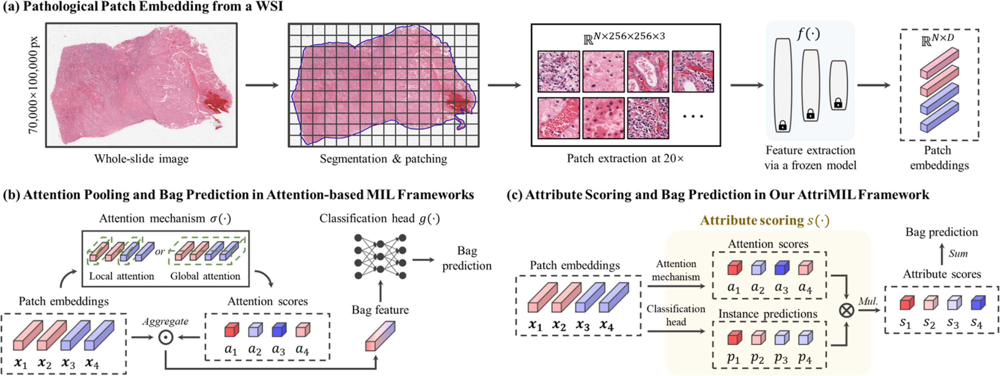
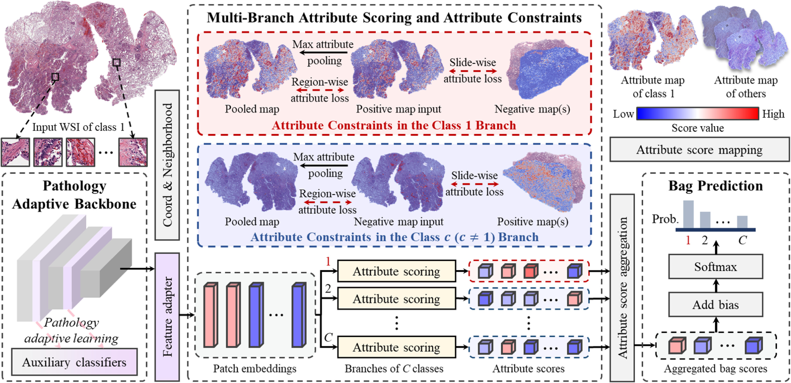
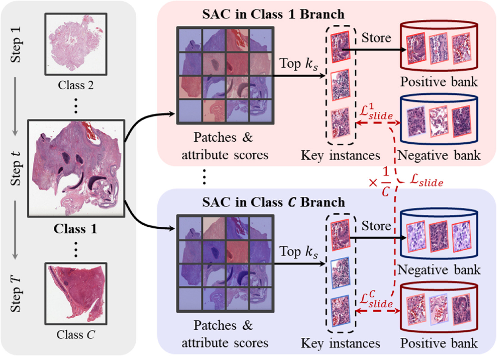
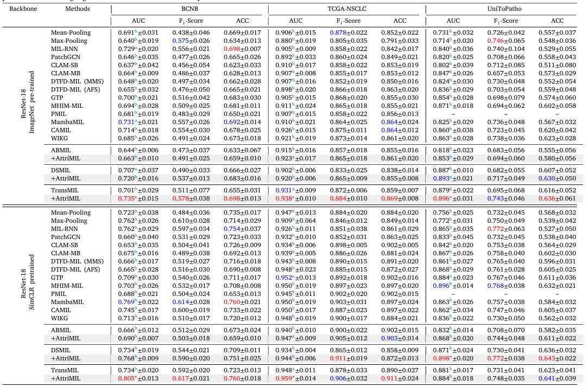
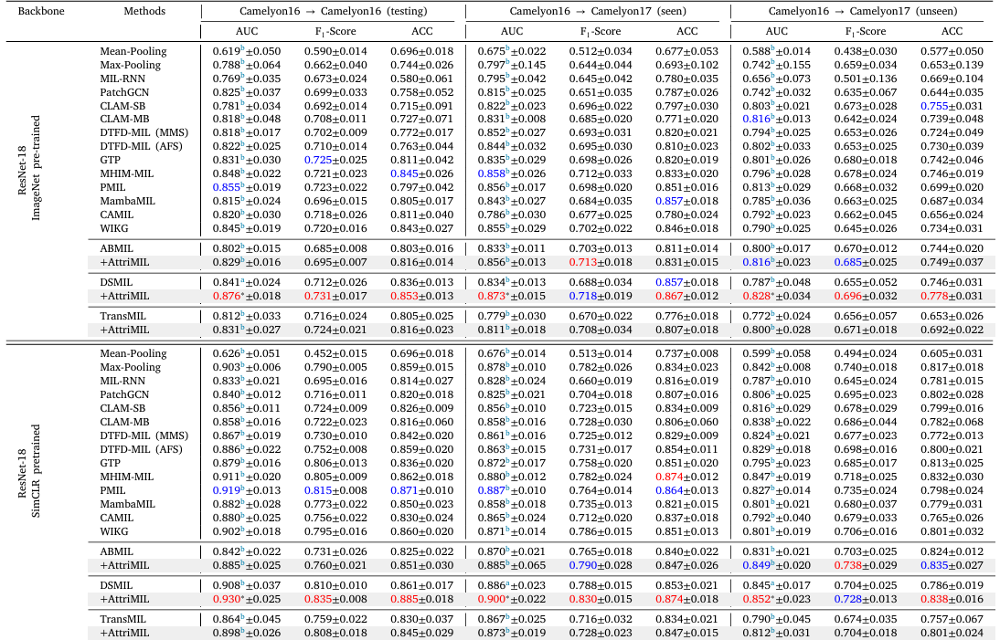

## AttriMIL: Revisiting attention-based multiple instance learning for whole-slide pathological image classification from a perspective of instance attributes

> data:
>
> Camelyon16（[Ehteshami Bejnordi 等，2017](https://www.sciencedirect.com/science/article/pii/S1361841525001781#b17)）
>
> Camelyon17（[Bandi 等，2018](https://www.sciencedirect.com/science/article/pii/S1361841525001781#b2)）
>
> BCNB（[Xu 等，2021](https://www.sciencedirect.com/science/article/pii/S1361841525001781#b69)）
>
> TCGA-NSCLC, [2](https://www.sciencedirect.com/science/article/pii/S1361841525001781#fn2)
>
>  UniToPatho（[Barbano 等，2021 ）。](https://www.sciencedirect.com/science/article/pii/S1361841525001781#b3)
>
> code:https://github.com/MedCAI/AttriMIL

#### 引言

##### 问题:

首先，注意力分数并不总是实例属性的可靠指标。基于注意力机制的 MIL 的输出由注意力机制和包分类头共同决定。因此，仅仅依靠注意力权重进行实例区分是一种不完整且可能产生误导的解决方案。

其次，实例独立的假设限制了 MIL 框架对实例之间内在相关性进行建模的能力。些相关性可分为载玻片内相关性和载玻片间相关性。

#### 相关工作

##### 基于实例的 MIL 

基于实例的 MIL 的核心思想是训练实例分类器，然后聚合实例预测以进行包分类。

##### 基于包的 MIL

#### 方法

（1）多分支属性评分

（2）区域属性约束

（3）滑动属性约束

#### 结果

> 参考文献
>
> Cai, Linghan et al. “Rethinking Attention-Based Multiple Instance Learning for Whole-Slide Pathological Image Classification: An Instance Attribute Viewpoint.” *ArXiv* abs/2404.00351 (2024): n. pag.

