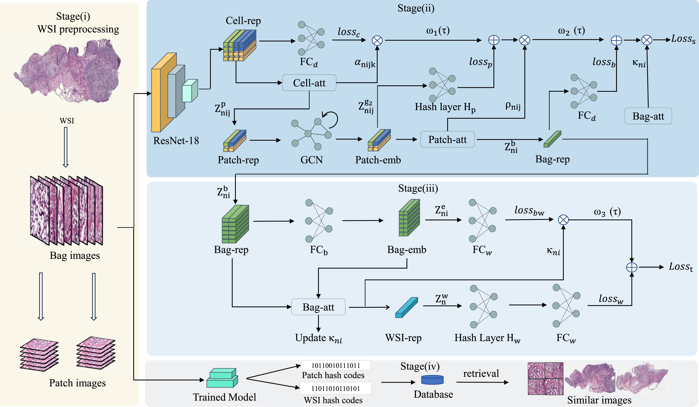

## Dynamic graph based weakly supervised deep hashing for whole slide image

> data:
>
> **胃腺癌 (STAD)**
>
> **CAMELYON16**
>
> **CAMELYON17**
>
> code:https://github.com/hcjin0816/DG_WSDH

#### 相关工作

##### 注意力机制的MIL

衡量一个包中每个实例的重要性。这使得模型可以选择性地关注重要的实例，而忽略不重要的实例。

DSMIL:基于自监督对比学习的新型双流架构，专注于通过可训练的距离向量分析实例之间的关系。

CS-MIL:提出了一种新的基于注意力机制的“早期融合”范式，旨在捕捉多尺度信息，并整体利用尺度间关系。

SA-MIL:引入了一种基于自注意力机制的新颖方法来增强跨多实例的学习过程。

TransMIL:提出了一个基于Transformer的框架，专门用于探索实例之间的形态和空间信息。

HIPT:提出了一种新的vit架构，它利用WSI的层次结构，并利用两级自监督学习来学习高分辨率图像表征。

##### 基于 GCN 的方法

对于基于 MIL 的病理组织图像分析，每个实例都被视为图中的一个节点，并根据实例间的位置信息或特征构建边。

#### 方法

（1）基于多尺度表示注意的深度网络；

（2）基于块的动态图；

（3）散列编码。 

#### 结果

不同方法在 STAD、CAMELYON16 和 CAMELYON17 三个数据集上的分类结果。我们在每个设置下将最佳结果加粗，将次优结果加下划线。

> 参考文献
>
> Jin, Haochen et al. “Dynamic graph based weakly supervised deep hashing for whole slide image classification and retrieval.” *Medical image analysis* 101 (2025): 103468 .
