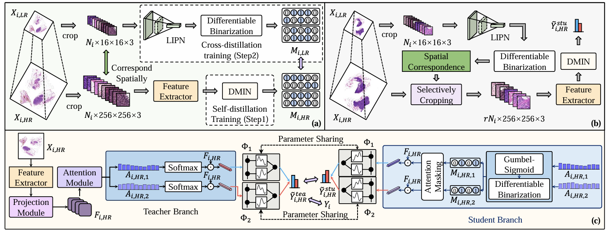
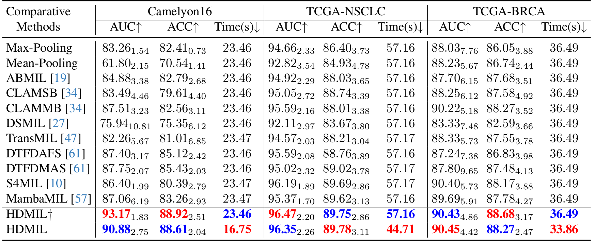

## Fast and Accurate Gigapixel Pathological Image Classification with Hierarchical Distillation Multi-Instance Learning

> data:
>
> **CAMELYON16**
>
>  **TCGA-NSCLC**
>
>  **TCGA-BRCA**
>
> code: [Github]( https://github.com/JiuyangDong/HDMIL)

#### 方法

#### 结果

> 参考文献
>
> Dong, Jiuyang et al. “Fast and Accurate Gigapixel Pathological Image Classification with Hierarchical Distillation Multi-Instance Learning.” *ArXiv* abs/2502.21130 (2025): n. pag.