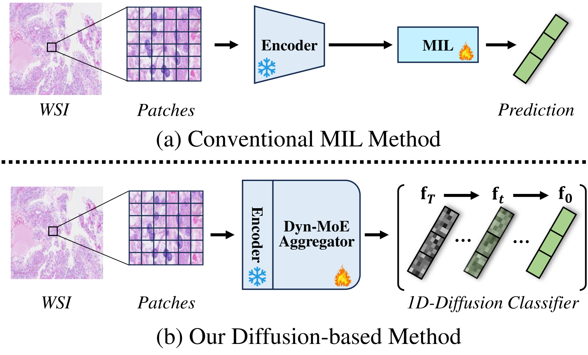

## MExD: An Expert-Infused Diffusion Model for Whole-Slide Image Classification

> data:
>
> **CAMELYON16**
>
> **TCGA-NSCLC**
>
> **BRAC**
>
> code: [Github](https://github.com/JWZhao-uestc/MExD)

### 引言

问题1:在一个包中，阳性实例（例如，包含癌细胞的情况）通常远多于阴性实例。这种不平衡会使模型偏向多数类，导致其忽略或错误分类重要的少数类实例，从而在检测罕见但临床重要的特征时敏感性差。

问题2:标准的聚合方法——如简单的平均或最大池化——可能不足以捕捉图像块之间复杂的相互关系和空间依赖性。

动态专家混合（Dyn-MoE）聚合器:它根据实例的相关性和特征智能地将实例路由到专业专家。这种动态路由机制确保了对少数类的关注，增强了对接收但临床意义重大的实例的敏感性，并减少了对接收类的偏见。本质上，Dyn-MoE 提取了重要的条件信息——既包括专家见解也包括先验预测——以有效地指导后续操作。

### 相关工作

大多数方法采用池化[4, 30]和注意力机制[19, 23, 38]来识别预测性特征。然而，这些方法往往忽略了实例间相关性，限制了其有效性。

### 方法

### 结果

> 参考文献
>
> Zhao, Jian-wen et al. “MExD: An Expert-Infused Diffusion Model for Whole-Slide Image Classification.” *ArXiv* abs/2503.12401 (2025): n. pag.
