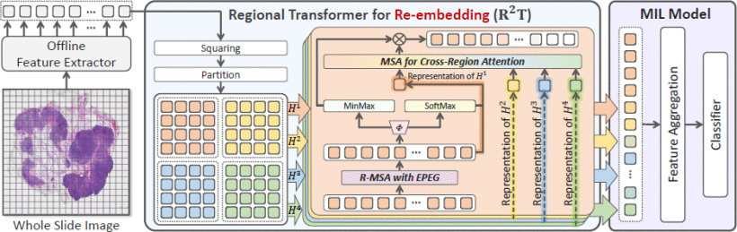
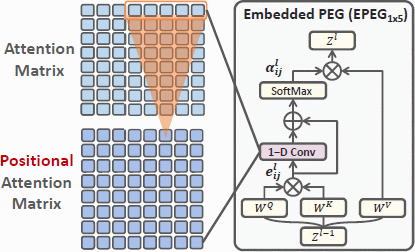
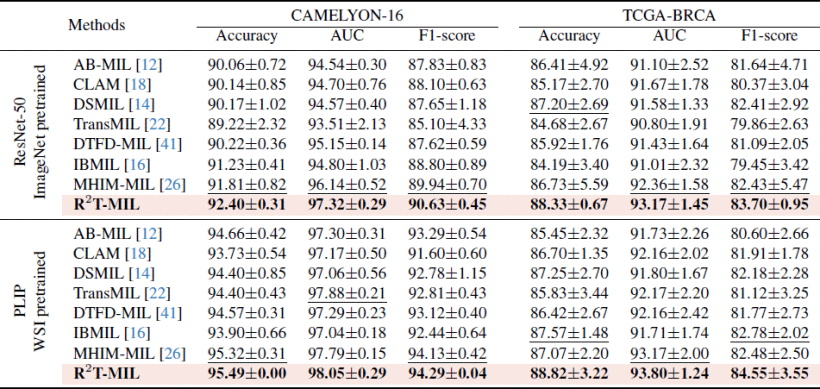

# Feature Re-Embedding: Towards Foundation Model-Level Performance in Computational Pathology

> data:
>
> **CAMELYON-16 [[1\]](javascript:void())** (C16)、**TCGA-BRCA**和**TCGA-NSCLC**
>
> **TCGA-LUAD、TCGA-LUSC 和 TCGA-BLCA**
>
> code: [Github](https://github.com/DearCaat/RRT-MIL)

#### 方法

$\begin{equation*} \hat{Y}\succ \mathcal{M}(X):=\mathcal{C}(\mathcal{A}(\mathcal{R}(\mathcal{F}(X)))), \tag{2} \end{equation*}$

创新点就是R()重新嵌入的映射函数

$\begin{align*} & \boldsymbol{ Step 1: } H \in \mathbb{R}^{I \times D} \xrightarrow{\text{Squaring }} H \in \mathbb{R}^{L^2 \times M^2 \times D}, \\ & \boldsymbol{ Step 2: } H \xrightarrow{\text{Partition }}\left\{H^l\right\}_{l=1}^{L^2}, H^l \in \mathbb{R}^{M \times M \times D},\\ & \boldsymbol{ Step 3: } \hat{Z}:=\left\{\hat{Z}^l\right\}_{l=1}^{L^2}, \hat{Z}^l=\mathcal{S}\left(H^l\right) \in \mathbb{R}^{M \times M \times D}, \tag{5} \end{align*}$

s()是EPEG

#### 结果

