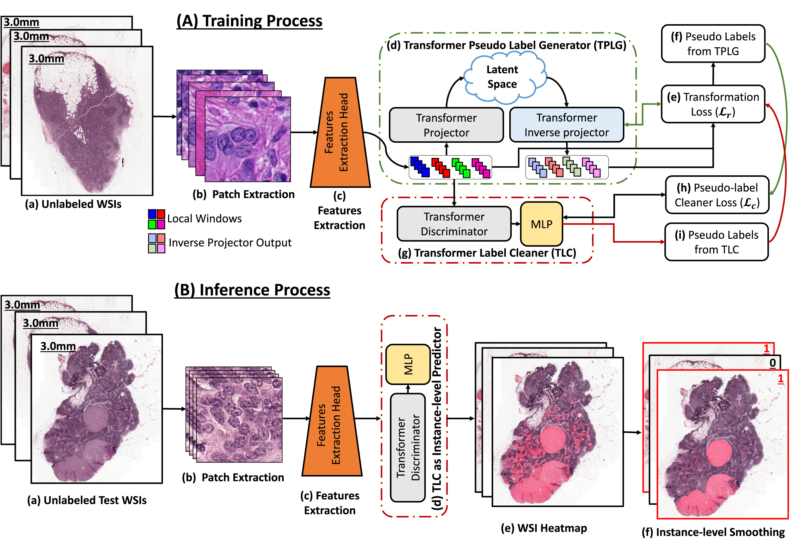

## Unsupervised mutual transformer learning for multi-gigapixel Whole Slide Image classification

#### 引言

我们的算法受到观察WSI 中负块和正块的自动编码器重构误差[行为的](https://www.sciencedirect.com/topics/neuroscience/behavior-neuroscience)启发。我们发现，与负块相比，正块的这种误差通常更为显著。我们的解释是，负片比正片更同质，正片在纹理和图案方面表现出更大的变化（[Turashvili and Brogi，2017](https://www.sciencedirect.com/science/article/pii/S1361841524001282#b67)；[Alizadeh et al.，2015](https://www.sciencedirect.com/science/article/pii/S1361841524001282#b2)；[Marusyk and Polyak，2010](https://www.sciencedirect.com/science/article/pii/S1361841524001282#b53)）。我们通过测量 CAMELYON-16 数据集中所有正片的 DCT 变换的平均片内熵为 0.881（负例为 0.556）来验证这一事实。通过测量每个片内小局部窗口之间的相似性也验证了同样的事实。使用皮尔逊[相关系数](https://www.sciencedirect.com/topics/earth-and-planetary-sciences/correlation-coefficient)(PCC)，我们发现正例局部窗口内片内平均 PCC 为 0.357，而负片的平均 PCC 为 0.771。

**说白了正片之间的更差异化,负片之间更相似**

#### 方法

（A）训练过程：（a）显示未标记的 WSI，（b）提取大小为 224×224×3 像素的实例；（c）特征提取头；（d）Transformer 伪标签生成器 (TPLG)；（e）TPLG 变换损失（等式[(4)](https://www.sciencedirect.com/science/article/pii/S1361841524001282#fd4)）；（f）来自 TPLG 的伪标签（等式[(5)](https://www.sciencedirect.com/science/article/pii/S1361841524001282#fd5)）；（g）Transformer 伪标签清理器 (TLC)；（h）伪标签清理器损失（等式[(6)](https://www.sciencedirect.com/science/article/pii/S1361841524001282#fd6)）；以及（i）来自 TLC 的伪标签（等式[(7)](https://www.sciencedirect.com/science/article/pii/S1361841524001282#fd7)）。 

（B）推理过程：（a）未标记的测试 WSI，（b）大小为 224 × 224 × 3 像素的实例，（c）特征提取头，（d）训练有素的 TLC 网络用作实例级标签预测器，（e）预测的 WSI 图，其中红色区域显示正实例，以及（f）实例级标签平滑过程和滑动级标签预测。

Transformer伪标签生成器 (TPLG)根据变换误差为图块分配正/负标签

Transformer 伪标签清理器 (TLC)最小化原始特征向量和逆变换特征向量之间的变换误差。