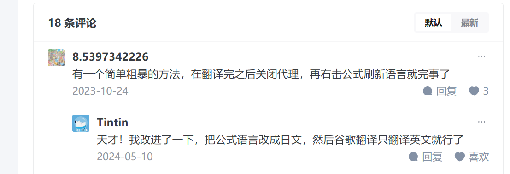

# 翻译技巧

本来Google网页看论文翻译还挺更好的,就是公式也翻译导致乱码,今天在复制公式的时候无意间发现换了公式语言就正常了,后面才反应过来自己没有挂代理,google没有翻译当时之前的翻译缓存了就造成正常的效果,当时还是不方便突然就想找找有没有说明解决方法,刚好发现



当时他的第二个方案没有成功

后面发现可以在开发者模式使用

```js
// 网页中带有公式的元素 math\.math\.MathJax
$('math, .math, .MathJax').attr('translate','no');
```

或者

```js
//部分不支持translate的浏览器（如Edge），需要在公式元素<tex-math>中添加notranslate：
$("tex-math").addClass("notranslate");
```

