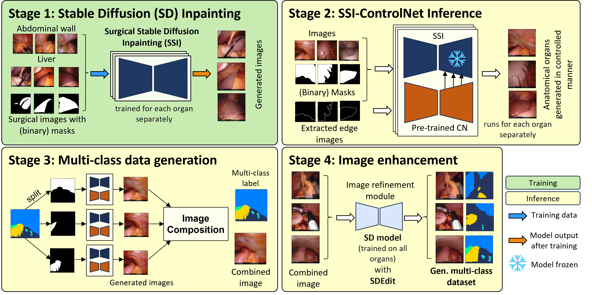

## Data Augmentation for Surgical Scene Segmentation with Anatomy-Aware Diffusion Models

> pdf:[Data Augmentation for Surgical Scene Segmentation with Anatomy-Aware Diffusion Models](https://arxiv.org/abs/2410.07753v2)(WACV 2025)
>
> code: [NCT-TSO-Public / Multi-class image synthesis · GitLab](https://gitlab.com/nct_tso_public/muli-class-image-synthesis)
>
> data:

#### 引言

GANs方法通常难以生成具有足够多样性的高质量图像。

#### 方法

首先使用真实手术图像和分割掩码，通过修复目标来训练 SD 模型。

stage1:在扩散过程中，通过掩码确定需要修复的区域，结合器官类型的文本提示，使模型学习特定器官的纹理特征。

stage2:利用从分割掩码中提取的边缘图像作为控制信号，实现对器官结构的精准控制。推理时仅在掩码区域生成新的器官纹理，同时保持背景不变，确保器官形状的准确性

stage3:将通过 SSI-ControlNet 模型生成的不同器官图像，根据各自的分割掩码裁剪出来，再组合成包含多种解剖结构的多类手术图像，并生成对应的语义标签，确保多器官组合时的结构和纹理一致性。

stage4:采用 SDEdit 方法修复图像合成过程中出现的锐边、光照不一致等问题。通过训练好的 Stable Diffusion 模型对合成图像进行降噪优化，可选择性地添加低水平噪声以提升纹理细节，使生成图像更接近真实手术场景。

> 参考文献
>
> Venkatesh, Danush Kumar et al. “Data Augmentation for Surgical Scene Segmentation with Anatomy-Aware Diffusion Models.” *2025 IEEE/CVF Winter Conference on Applications of Computer Vision (WACV)* (2024): 2280-2290.

